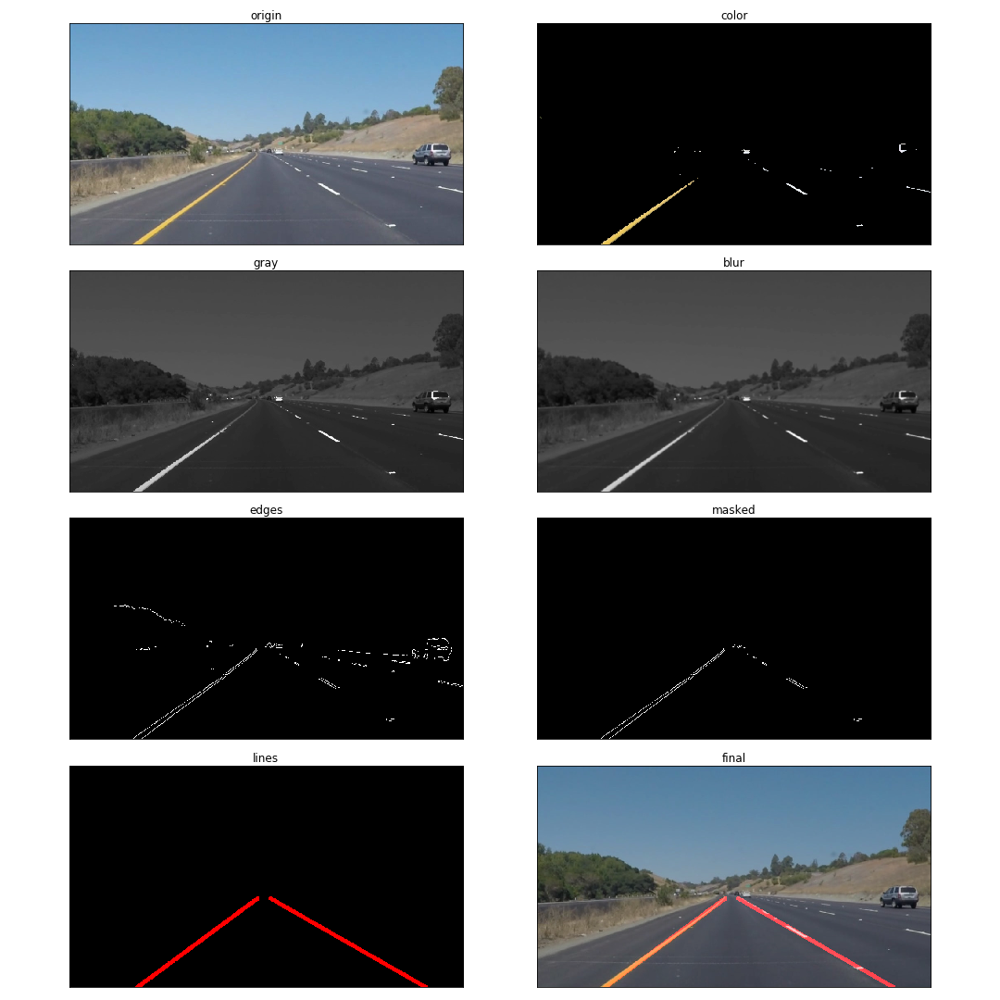
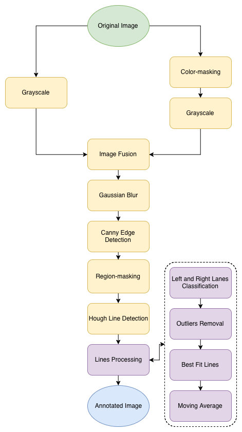
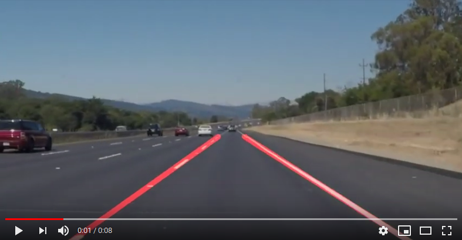

# **Finding Lane Lines on the Road** 

**Objective**

When we drive, the lane markings on the road are our visual references to steer the vehicle. For self-driving car, these lane markings become important visual cues to navigate the road infrastructure. This project describes a image-processing pipeline to detect the lane lines by using Computer Vision techniques through Open Computer Vision Library (OpenCV) in Python.  

**Processed Image:**

  

**Pipeline Chart:** 

  

**Videos:**

  

## Reflection

**Algorithm Overview**

1. Convert RGB to Grayscale
   
   This process is done on the original image as we only need the intensity of pixels for the later part of the pipeline.

2. Color-masking

   As lane marking is primarily white or yellow, this process is done to retain only those parts of original image are that detected as lane-markings. This process is achieved using HSV thresholds instead of RGB thresholds because color can be better classified using their Hues. Again, the remaining image undergoes grayscaling.
   
3. Image Fusion

   Both the grayscaled image from the original source and the color-masking source are fused together. The original image helps capture details that are lost in color-masking while the color-masked image helps emphathize detected lane-markings. 

4. Gaussian Blur

   This process is applied to remove noises of pixel intensity in the image. It takes a kernel size -- the bigger, the blurrier.

5. Canny Edge Detection

   This process is applied to detect edges in the image using the gradient of pixel intensity. It takes a high and low threshold -- which determine the minimum gradient to establish an edge, and the minimum gradient to establish a continuous extension to an edge, respectively.

6. Region-masking

   This process is applied to remove all edges that are outside the region-of-interest. As the camera is mounted on a fixed position on the car, the position of the lane markings are usually located within this region. 

7. Hough Line Detection

   This process is applied to detect straight lines from the edges. There are a number of parameters required. It takes resolution of line position and orientation to detect intersections in the Hough space, a minimum number of points to establish a line, the minimum length required to establish a line, and the maximum gap between points allowed for a line.

8. Line Processing

   This process is applied to combine a collection of lines into two main lines, as left lane and right lane. Firstly, lines are classified into left lane lines and right lane lines by their slopes and midpoints. After that, outliers in the slope are removed to increase accuracy of the data. Subsequently, two best fit lines are applied on the left lane lines and right lane lines respectively using least square fit. Finally, a moving average filter is applied across consecutive frames to improve performance as certain frames might not contain detected lanes. 

**Potential shortcoming**

1. Pipeline might not be tuned to different lighting conditions which affect the hues and contrasts of lane markings.

2. Pipeline cannot generalized to handle curve road or bumpy straight road.

3. Pipeline cannot detect multiple lanes.

**Possible Improvements**

1. Pipeline needs to be tested under vastly different lighting conditions or weathers to further refine parameters.

2. Pipeline needs to be modified to detect multiple lanes for lane switching.

3. Pipeline needs to be modified to detect curve.

4. Pipeline needs to function well when there is less/no line marking.

5. Pipeline needs to take advantage of parallel computing to reduce processing time.

